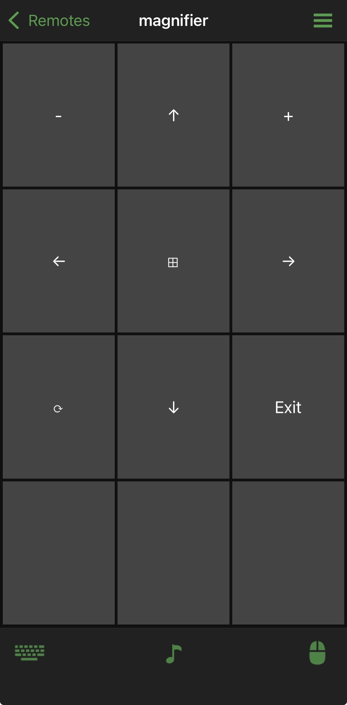

# Unified Remote - X11 Magnifier

Custom **Unified Remote** remote for Linux **X11** that uses [`xdotool`](https://github.com/jordansissel/xdotool) to control zoom and nudge the mouse, similar to the Magnifier workflow on Windows.

## Why this exists

I control my machine from a distance at times. I've moved from Windows 11 to Kubuntu and wanted something that still behaved like the Windows Magnifier remote that's bundled with Unified Remote, while also allowing the use of the native iOS keyboard.

Due to the behaviour of **Wayland**, I swapped to **X11** to get the keyboard working reliably (unrelated to this remote, but worth noting). I also wanted to use `xdotool` to send the key actions, which is a common tool for simulating keyboard input and mouse actions on X11.

## What it does

- Sends zoom in/out/exit key actions through `xdotool`
- Nudges the mouse directionally in fixed steps
- Includes a dedicated Super key action
- Includes a button to refresh the zoom if it bugs out.
- Several unused buttons that could be customized for additional functionality

## Requirements

- Unified Remote server running on your [Linux machine](https://www.unifiedremote.com/download/other#linux)
- `xdotool` installed on the host machine
  - Project: https://github.com/jordansissel/xdotool


## Installation

Make sure you have the requirements installed and make sure your Unified Remote server is [running](http://localhost:9510/web/).

Place this remote in your Unified Remote custom remotes folder on the Linux host:

```text
~/.urserver/
└── remotes/
    └── custom/
        └── magnifier/
            ├── meta.prop
            ├── remote.lua
            └── layout.xml
```

After copying the files, restart the Unified Remote server (or reload remotes) so it appears in the app.

## Tested environment

- OS: Kubuntu 25.10
- Session: X11
- Kernel: Linux `6.17.0-14-generic` `x86_64`
- iOS Unified Remote app: `1.6.5 (109)`
- Unified Remote server: `3.14.0.2574 (53)`

## Screenshot

Remote shown in the Unified Remotes iOS app:




## License

This project is licensed under the MIT License. See [`LICENSE`](LICENSE).
